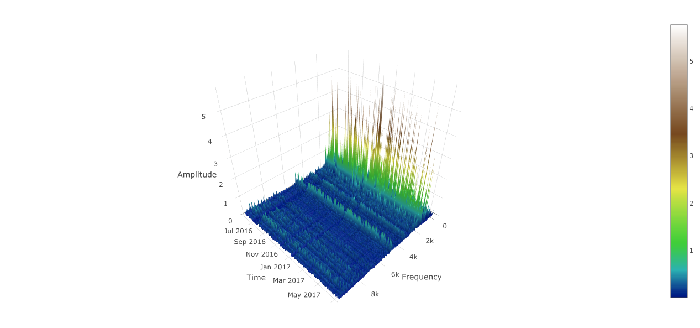

## Alpha-I Plotly Surface plugin

Warning!
This plugin is in develop mode.

### Screenshot



This plugin help to visualize 3 dimensional waterfall charts. It works on Elasticsearch datasource and the document must have the following structure:

```javascript
{
    "timestamp" : "2010-04-04 12:00:00",
    "x": [10, 20, 40, 80, 160],
    "y": [7, 12, 12, 16, 10],
    "unit_of_measure": "Hz"

}
```

This document carries a bi-dimensional data structure where the the `x` contains the labels for the columns and the `y` the values such as
`y[i]` is the amplitude of a signal for a `x[i]` unit_of_measure.

In the example, if _i_ = 3, at the time _2010-04-04 12:00:00_ at `80 Hz` there is an amplitude of `16`.

x.length == y.length

Given a time range, the plugins load a list of documents lined in the Plotly Y Axis using the `timestamp` field.
The for a single slice, the Plotly `Z Axis` has the value of the document `y` and the Plotly `Y axis` has the value of the document `x`


### Building

To compile, run:

```
npm install -g yarn
yarn install --pure-lockfile
grunt
```
